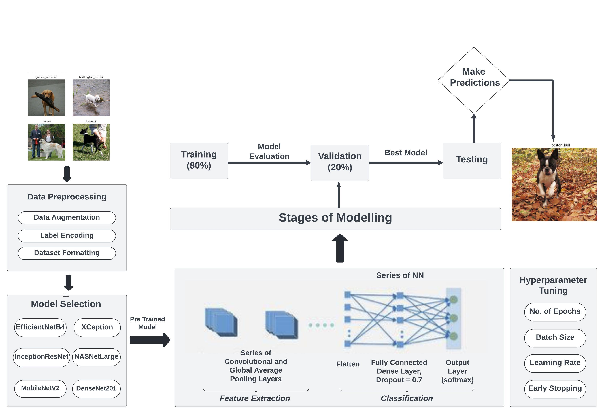
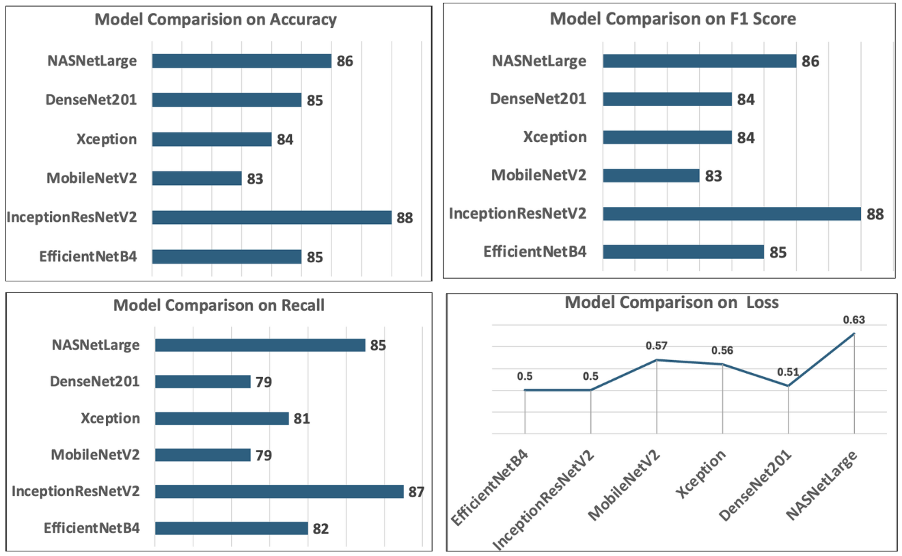
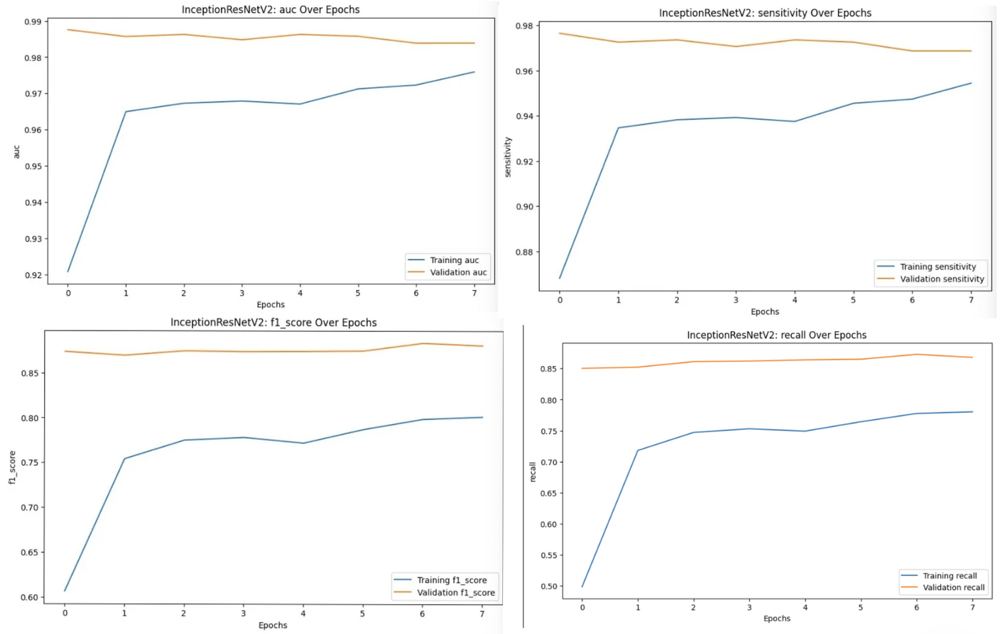

### Dog Breed Image Recognition using AI

This repository contains **Python** code for predicting dog breeds from images using advanced deep learning models. After evaluating the performance of multiple models, **InceptionResNetV2** is chosen as the best-performing one, thereby using it for the main predictions.

## Motivation

The ability to accurately identify dog breeds from images is not only a fun and engaging challenge but also has practical applications in areas such as veterinary care, pet adoption, and even lost pet recovery. According to the American Kennel Club (AKC), there are nearly 200 recognized dog breeds, each with distinct characteristics and traits. For pet owners, veterinarians, and animal shelters, the ability to swiftly and accurately identify a dog's breed can significantly aid in understanding the pet's behavior, health predispositions, and care requirements.

## Dataset

The dataset used for this project is sourced from Kaggle's Dog Breed Identification competition. It contains thousands of images across various breeds, providing a robust foundation for training a deep learning model. The data is structured as follows: - **id**: The unique identifier for each image file. - **breed**: The breed of the dog in the image.

The dataset contains 10,222 images, each associated with one of 120 unique dog breeds.

## Machine Learning Models

The Python code in this repository leverages **TensorFlow**, **Keras** and other relevant libraries to implement and evaluate several deep learning models, including:

-   EfficientNetB4
-   InceptionResNetV2
-   MobileNetV2
-   Xception
-   DenseNet201
-   NASNetLarge

The code provides a comprehensive evaluation of each model's performance using various metrics like accuracy, loss, precision, recall, AUC , specificity, sensitivity and F1-score. After evaluation, InceptionResNetV2 is selected as the best-performing model for dog breed classification.

## Usage

 

1.  Clone this repository and navigate to the project directory on your local machine.
2.  Install the required dependencies mentioned using the following command: `pip install -r requirements.txt`
3.  Run the notebook cells step-by-step to:
    -   Explore the data and perform EDA (Exploratory Data Analysis)
    -   Pre-process the data to achieve the required format
    -   Train and evaluate multiple models, and compare them
    -   Use the best-performing model for **dog breed prediction**

## Code Components

### 1) Data Preprocessing

Preparation and standardization of the dataset for optimal model training:

-   **Resizing and Normalizing**: Adjust images to 224x224 pixels and scale pixel values to a [0,1] range for uniformity and faster convergence.

-   **Data Augmentation**: Enhance dataset size and diversity to prevent model overfitting.

-   **Label Encoding and Splitting**: Convert breed names into numerical format and split the dataset into 80% training and 20% validation sets.

### 2) Model Training and Evaluation

Detailed steps for training deep learning models and evaluating their performance:

-   **Model Implementation**: Use multiple models like EfficientNetB4, InceptionResNetV2, and others, assessing each for its efficacy.

-   **Hyperparameter Tuning**: Optimize learning parameters such as epochs and batch size to enhance model performance.

-   **Metrics Evaluation**: Measure accuracy, precision, recall, F1-score, and more to determine model effectiveness.

-   **Best Model Selection**: Chose **InceptionResNetV2** for its superior metrics across the board.

### 3) Visualization of Results

-   **Model Comparisons**

1.  **Categorical Accuracy**:
    -   **InceptionResNetV2** leads with 88.26% accuracy, demonstrating its ability to correctly classify a significant portion of dog breeds.
    -   **MobileNetV2** records the lowest accuracy at 83.07% among the models evaluated.
2.  **F1 Score**:
    -   **NASNetLarge** achieves the highest F1 score of 86.37%, balancing precision and recall effectively.
    -   **DenseNet201** follows closely with an F1 score of 84.30%, despite its high AUC.
3.  **Loss**:
    -   **EfficientNetB4** achieves the lowest validation loss of 49.80, indicating strong generalization to unseen data.
    -   **NASNetLarge** exhibits the highest loss at 63.37, possibly due to overfitting or less effective learning.
4.  **Precision and Recall**:
    -   **DenseNet201** demonstrates the highest precision at 89.91%, highlighting its accuracy in relevant label prediction.
    -   **NASNetLarge** shows superior recall at 85.23%, excelling in identifying relevant instances.

**Best Model Consideration**: Based on these metrics, **InceptionResNetV2** emerges as the optimal choice. It combines high accuracy, robust F1 score, and competitive AUC, making it well-suited for precise dog breed classification tasks. Its balanced performance across multiple evaluation criteria suggests reliability in real-world applications requiring accurate breed identification.

-   **Best Model : InceptionResnetV2's Performance**

These plots illustrate the performance of **InceptionResNetV2** over training epochs:

1.  **AUC**: Validation AUC remains consistently high (\~0.98) throughout training, indicating strong overall model performance.

2.  **Sensitivity**: Validation sensitivity is stable, indicating the model effectively identifies true positives across epochs.

3.  **F1 Score**: The validation F1 score remains higher than the training score, demonstrating the model's balanced precision and recall on unseen data.

4.  **Recall**: Validation recall stays consistently high (\~0.85), suggesting the model reliably retrieves relevant instances.

Overall, **InceptionResNetV2** shows strong, stable performance on validation data across key metrics, indicating effective generalization.

### 4) Testing with Custom Input

his model processes input images of shape $224 \times 224 \times 3$, and the final output consists of 120 classes, corresponding to different dog breeds. The inclusion of data augmentation and dropout layers helps in regularization, potentially reducing overfitting. The displayed images with predicted breeds and their probabilities provide a visual validation of the model’s effectiveness. The model demonstrates a strong capability to identify various dog breeds with high confidence, indicated by probability scores close to 1.0 for several breeds as seen below.

## Conclusion

These observations collectively illustrate that the InceptionResNetV2 -based model is well-optimized and effective for the task of dog breed identification, demonstrating high accuracy and reliability in its predictions. The visual outputs confirm the model's practical utility in correctly classifying dog breeds with high confidence.

## Contribution

Contributions to this repository are welcome! If you would like to suggest better Deep Learning Model(s), improve data preprocessing, or enhance any segment of the project, feel free to open a pull request.

## License

This project is licensed under the MIT License.

## Credits

This project is in collaboration with [Ayush Heda](https://github.com/ACM40960/project-hedayush97).

## References

-   [Dog Breed Identification Dataset](https://www.kaggle.com/competitions/dog-breed-identification/data)
-   Sharma, S., and Kumar, S., 2021. [The Xception Model: A Potential Feature Extractor in Breast Cancer Histology Images Classification](https://www.sciencedirect.com/science/article/pii/S240595952100165X). Informatics in Medicine Unlocked, 25.
-   Noor Abdalkareem Lafta and Abbood, A. (2024). [Comprehensive Review and Comparative Analysis of Keras for Deep Learning Applications: A Survey on Face Detection Using Convolutional Neural Networks](https://ijor.co.uk/ijor/article/view/5507). International Journal of Religion.

Thank you for using our Jupyter Notebook!
